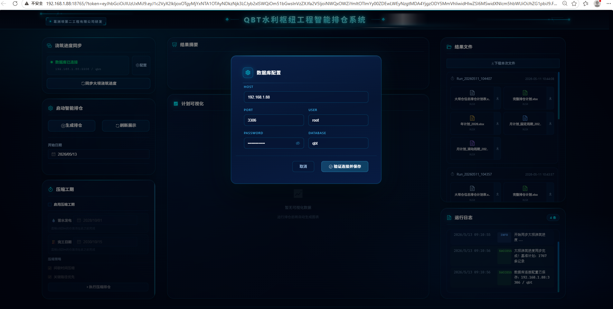
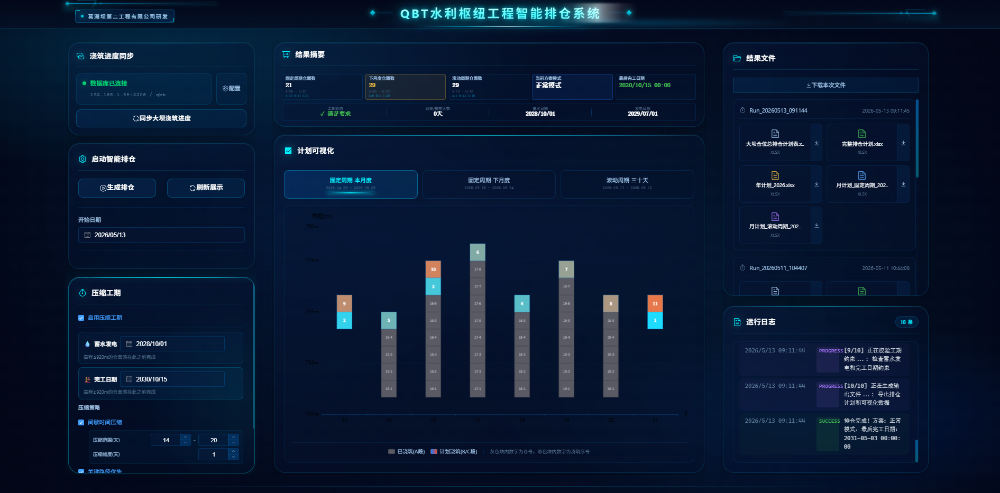
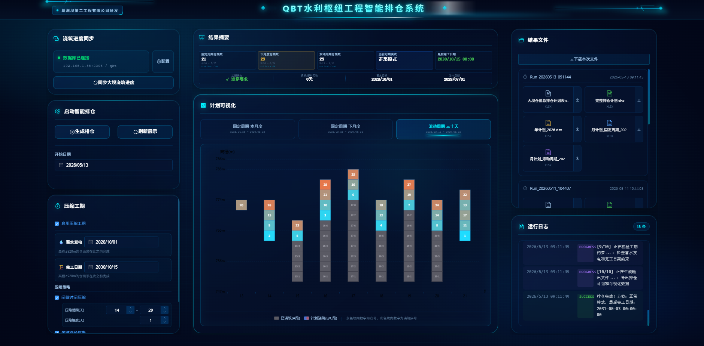
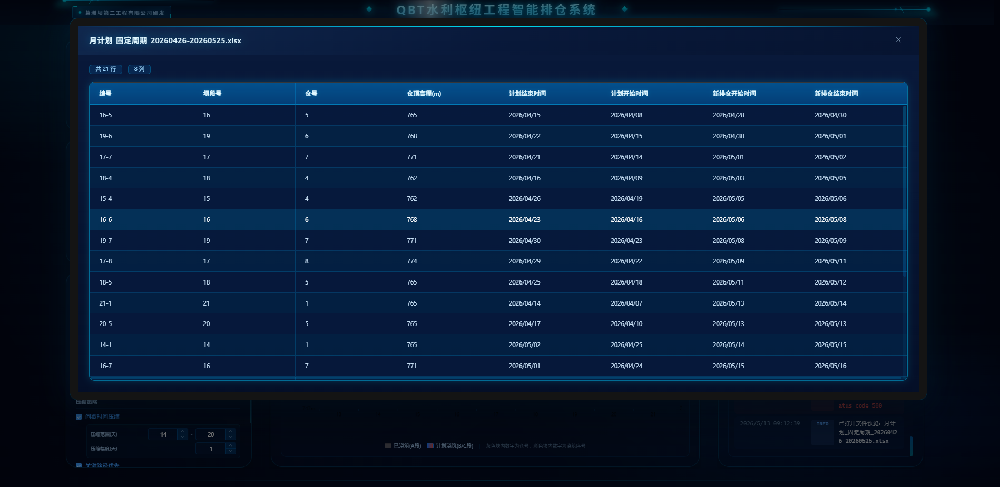
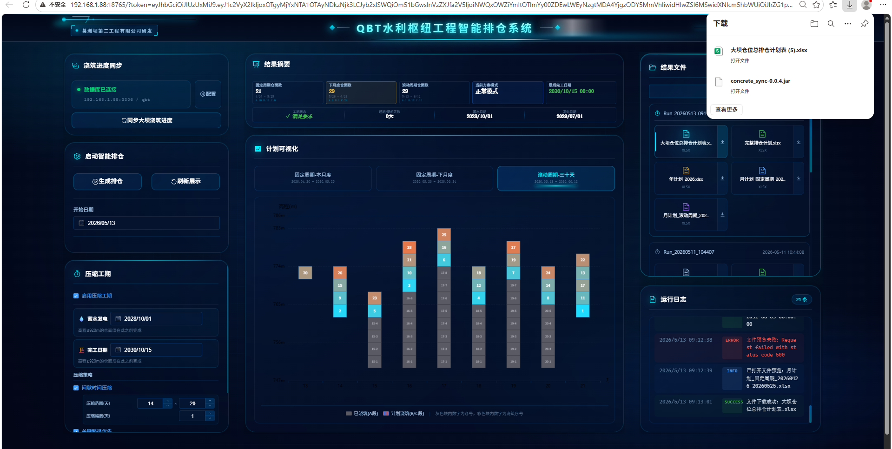
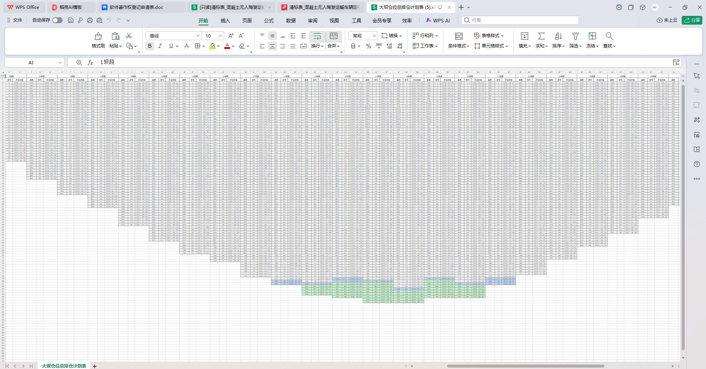
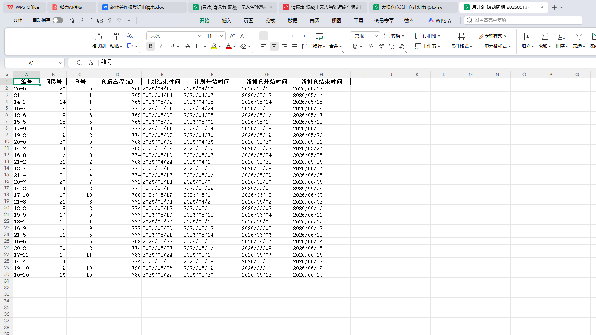

# 🏗️ 拱坝智能排仓系统 (Dam Scheduling System)

<p align="center">
  
  
  
  
</p>

<p align="center">
  <b>基于多目标智能优化的大坝混凝土浇筑排程系统</b><br>
  <i>智能建造实验室 · 拱坝施工动态规划课题组</i>
</p>

---

## 📖 项目背景

在水利工程施工中，拱坝混凝土浇筑是核心环节之一。一座大型拱坝通常包含 **1700+ 个浇筑仓位**，涉及复杂的施工约束、资源调度和进度管理。传统的人工手动排仓方式面临以下挑战：

- ❌ **排仓效率低**：人工规划1700多个仓位需要数周时间
- ❌ **约束冲突多**：高程约束、缆机资源、间歇时间难以统筹
- ❌ **动态响应差**：无法快速适应实际进度变化
- ❌ **优化程度低**：难以找到全局最优的排仓方案

**本系统应运而生**，通过智能算法实现：
- ✅ 实时同步浇筑进度
- ✅ 多目标智能优化排仓
- ✅ 自动处理冬歇期等施工约束
- ✅ 工期压缩与关键路径优化

---

## 🎯 核心功能

### 1. 智能排仓算法
| 算法模块 | 技术特点 | 应用场景 |
|---------|---------|---------|
| **AHP层次分析法** | 专家判断矩阵 + 一致性检验(CR<0.1) | 主观权重计算 |
| **熵权法** | 基于数据离散度的客观赋权 | 客观权重计算 |
| **组合权重** | α×AHP + (1-α)×熵权 | 综合决策 |
| **前沿驱动排序** | 三级约束漏斗(L1/L2/L3) | 仓位排序优化 |

### 2. 约束处理引擎
- **高程约束**：相邻坝段高差≤6m，全坝高差≤12m
- **缆机调度**：4台缆机动态排班，日容量优化
- **间歇控制**：7-20天可配置间歇窗口
- **冬歇期处理**：自动避开11/1-4/10施工禁期

### 3. 工期压缩算法
- 蓄水目标导向的进度优化
- 关键路径优先调度
- 间歇时间智能压缩

---

## 🏗️ 系统架构

```
┌─────────────────────────────────────────────────────────────┐
│                    前端层 (Vue 3 + TypeScript)               │
│  ┌─────────────┐ ┌─────────────┐ ┌──────────────────────┐   │
│  │  数据库配置  │ │  运行参数   │ │     结果可视化        │   │
│  │  管理模块   │ │  控制模块   │ │   (ECharts图表)      │   │
│  └─────────────┘ └─────────────┘ └──────────────────────┘   │
│  ┌─────────────┐ ┌─────────────┐ ┌──────────────────────┐   │
│  │  实时日志   │ │  文件管理   │ │     进度同步         │   │
│  │  (WebSocket)│ │  (导入导出) │ │   (MySQL集成)        │   │
│  └─────────────┘ └─────────────┘ └──────────────────────┘   │
├─────────────────────────────────────────────────────────────┤
│                  后端层 (Python FastAPI)                     │
│  ┌──────────────┐ ┌──────────────┐ ┌──────────────────┐    │
│  │   AHP权重    │ │   熵权法     │ │   前沿选择排序    │    │
│  │   计算引擎   │ │   客观赋权   │ │   算法引擎       │    │
│  └──────────────┘ └──────────────┘ └──────────────────┘    │
│  ┌──────────────┐ ┌──────────────┐ ┌──────────────────┐    │
│  │   缆机调度   │ │   冬歇期     │ │   工期压缩       │    │
│  │   优化器     │ │   处理器     │ │   引擎           │    │
│  └──────────────┘ └──────────────┘ └──────────────────┘    │
├─────────────────────────────────────────────────────────────┤
│                    数据层 (MySQL + File)                     │
│         基准计划表 · 实际进度表 · 高程数据 · 排仓结果          │
└─────────────────────────────────────────────────────────────┘
```

---

## 🖼️ 系统界面展示

### 主控制台 - 数据库配置
<p align="center">
  
</p>
系统支持MySQL数据库连接配置，可实时同步大坝浇筑进度数据。

### 主控制台 - 完整界面
<p align="center">
  
</p>
蓝色科技大屏风格设计，包含浇筑进度同步、智能排仓、工期压缩、结果可视化等模块。

### 计划可视化 - 滚动周期视图
<p align="center">
  
</p>
基于ECharts的动态渲染，展示坝段-层号浇筑顺序图，支持固定周期和滚动周期切换。

### 月计划详情预览
<p align="center">
  
</p>
详细的仓位排程表，包含坝段号、仓号、高程、计划时间、新排仓时间等关键信息。

### 文件下载与管理
<p align="center">
  
</p>
支持多种格式导出：完整排仓计划、年计划、月计划(固定/滚动周期)等。

### 输出成果 - 大坝仓位总排仓计划表
<p align="center">
  
</p>
<p align="center">
  
</p>
按坝段分组的完整排仓计划，绿色表示已完成(A段)，蓝色表示已排程(B段)，灰色表示待排程(C段)。

### 输出成果 - 月计划明细表
<p align="center">
  
</p>
包含编号、坝段号、仓号、仓顶高程、计划时间、新排仓时间等完整字段。

---

## 🚀 快速开始

### 环境要求
- Python 3.9+
- Node.js 16+
- MySQL 5.7+ (或 MariaDB)

### 安装步骤

#### 方式一：一键启动 (Windows)
```bash
cd dam-scheduling-system
start.bat
```

#### 方式二：手动启动

**启动后端：**
```bash
cd backend
python -m venv venv
venv\Scripts\activate
pip install -r requirements.txt
uvicorn main:app --host 0.0.0.0 --port 8000 --reload
```

**启动前端：**
```bash
cd frontend
npm install
npm run dev
```

### 访问系统
- 🌐 前端界面: http://localhost:3000
- 📚 API文档: http://localhost:8000/docs
- 🔍 健康检查: http://localhost:8000/health

---

## 📁 项目结构

```
dam-scheduling-system/
├── backend/                    # Python后端
│   ├── main.py                # FastAPI入口
│   ├── config.py              # 配置管理
│   ├── requirements.txt       # Python依赖
│   ├── api/                   # API路由
│   │   ├── database.py        # 数据库接口
│   │   ├── scheduling.py      # 排仓调度
│   │   └── files.py           # 文件管理
│   ├── core/                  # 核心算法
│   │   └── scheduling_algorithm.py  # 排仓算法实现
│   └── aiware_db/             # 数据库同步服务
│
├── frontend/                   # Vue3前端
│   ├── src/
│   │   ├── App.vue            # 根组件
│   │   ├── views/
│   │   │   └── Dashboard.vue  # 主控制面板
│   │   ├── components/        # UI组件
│   │   │   ├── DatabaseConfig.vue
│   │   │   ├── RunParameters.vue
│   │   │   ├── RunLog.vue
│   │   │   ├── ResultSummary.vue
│   │   │   ├── PlanVisualization.vue
│   │   │   └── FileManagement.vue
│   │   └── styles/
│   │       └── global.scss    # 全局样式(蓝色科技风)
│   └── package.json
│
├── docs/images/               # 文档图片
│   ├── image1.png ~ image8.png
│
└── start.bat                  # 一键启动脚本
```

---

## 🔧 核心算法详解

### 1. 权重计算体系

```python
# AHP主观权重 - 专家判断矩阵几何平均合成
def load_ahp_weights(ahp_file: str) -> Tuple[np.ndarray, float]:
    # 多专家判断矩阵合成
    composite_matrix = np.prod(all_matrices, axis=2) ** (1.0 / num_experts)
    # 一致性检验 CR < 0.1
    cr = ci / ri
    return weights, cr

# 熵权法客观权重 - 基于数据离散程度
def compute_entropy_weights(data_matrix: np.ndarray) -> np.ndarray:
    e = -k * (p * np.log(p + eps)).sum(axis=0)
    d = 1 - e  # 信息效用值
    weights = d / d.sum()
    return weights

# 组合权重
combined = alpha * w_ahp + (1 - alpha) * w_entropy
```

### 2. 前沿选择排序算法

**三级漏斗筛选机制：**
- **L1 (严格模式)**：相邻高差≤6m 且 全坝高差≤12m → 直接选择最优得分
- **L2 (放宽模式)**：相邻高差≤9m 且 全坝高差≤13m → 允许适度超限
- **L3 (兜底策略)**：综合代价最小化（含回拉奖励机制）

### 3. 缆机资源调度

```python
class CraneScheduler:
    """缆机调度器 - 动态排班与容量优化"""
    
    def schedule_by_crane_and_gap(self, sorted_report, start_date, mode='normal'):
        # 日最大容量：4台缆机
        # 同坝段间歇窗口：7-20天（可配置）
        # 双模式支持：正常模式 / 压缩模式
```

### 4. 冬歇期自动处理

```python
class WinterScheduleHandler:
    """冬歇期处理器 - 智能避开施工禁期"""
    
    # 自动避开：每年11月1日 ~ 次年4月10日
    # 保持相对顺序不变，整体后移至冬歇结束次日
```

---

## 📊 输出成果

运行完成后自动生成以下文件：

| 文件名 | 说明 | 格式 |
|--------|------|------|
| `大坝仓位总排仓计划表.xlsx` | 按坝段分组的完整排仓表 | Excel |
| `完整排仓计划.xlsx` | 全部仓位7列标准表 | Excel |
| `月计划_固定周期_YYYYMMDD.xlsx` | 上月26日至本月25日 | Excel |
| `月计划_滚动周期_YYYYMMDD.xlsx` | B段起始至下月同日前一天 | Excel |
| `年计划_YYYY.xlsx` | 本年度全部仓位 | Excel |
| `固定周期-全坝段浇筑顺序综合图.png` | 坝段-层号散点图 | PNG |
| `滚动周期-全坝段浇筑顺序综合图.png` | 滚动窗口视图 | PNG |

---

## ⚙️ 高级配置

可通过修改 `backend/config.py` 调整参数：

```python
# 权重配置
SCHEDULING_ALPHA = 0.5          # 主客观权重比例 (0-1)

# 缆机配置
MAX_CRANE_PER_DAY = 4          # 每日最大缆机数
MIN_GAP_DAYS = 7               # 最小间隔天数
MAX_GAP_DAYS = 20              # 最大间隔天数

# 高程约束
ADJ_HEIGHT_LIMIT = 6.0         # 相邻坝段高差限制(m)
GLOBAL_HEIGHT_LIMIT = 12.0     # 全坝最大高差限制(m)

# 冬歇期配置
WINTER_START_MONTH = 11        # 冬歇开始月份
WINTER_END_MONTH = 4           # 冬歇结束月份
```

---

## 🎯 使用流程

1. **配置数据库** → 填写MySQL连接信息并测试
2. **同步进度** → 从数据库同步实际浇筑进度
3. **设置参数** → 选择开始日期、是否启用压缩等
4. **执行排仓** → 点击"生成排仓"按钮
5. **查看结果** → 实时查看日志、结果摘要和可视化图表
6. **导出文件** → 下载生成的Excel报表和PNG图表

---

## 🔗 技术栈

### 前端技术栈
- **Vue 3.3+** - 渐进式JavaScript框架
- **TypeScript 5.3+** - 类型安全的JavaScript超集
- **Vite 5.0** - 下一代前端构建工具
- **Element Plus 2.4** - Vue 3组件库
- **ECharts 5.4** - 数据可视化库
- **SCSS** - CSS预处理器

### 后端技术栈
- **Python 3.9+** - 编程语言
- **FastAPI 0.104** - 现代Web框架
- **Uvicorn** - ASGI服务器
- **NumPy / Pandas / SciPy** - 数值计算与数据处理
- **PyMySQL** - MySQL数据库驱动
- **WebSocket** - 实时通信

---

## 👥 开发团队

**智能建造实验室 - 拱坝施工动态规划课题组**

本系统由智能建造实验室研发，专注于水利工程智能化施工管理领域，致力于通过人工智能和优化算法解决传统施工管理中的复杂决策问题。

---

## 📄 许可证

本项目采用 [MIT License](LICENSE) 开源许可证。

---

## 🙏 致谢

感谢所有参与本项目开发和测试的团队成员，以及提供宝贵意见的工程实践专家。

---

<p align="center">
  <b>⭐ 如果这个项目对您有帮助，请给它一个Star！</b>
</p>
