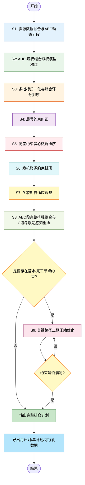
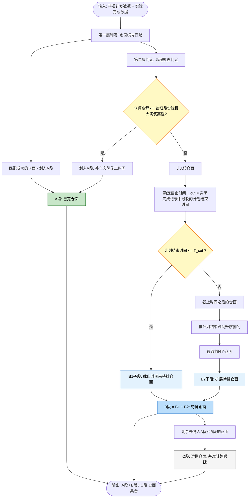
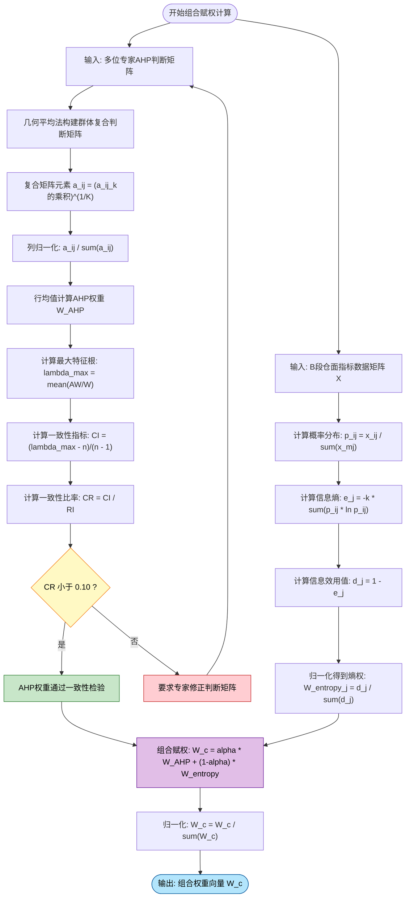
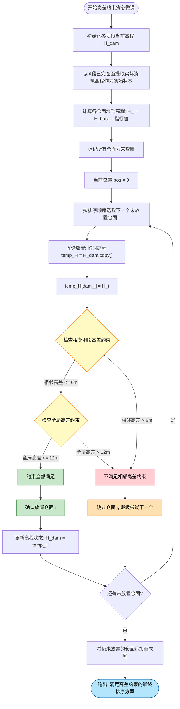
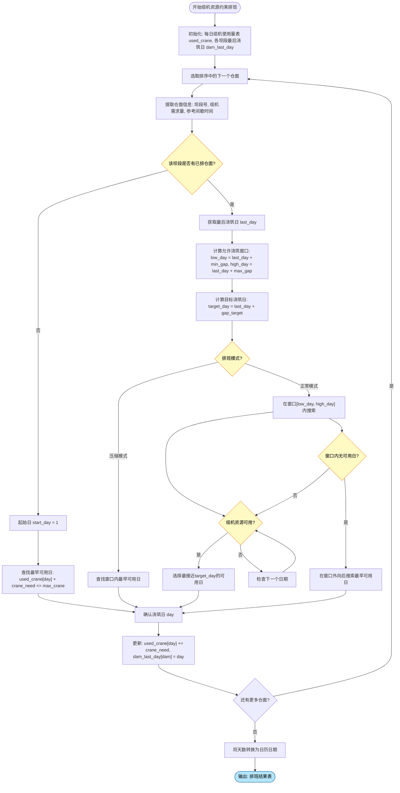
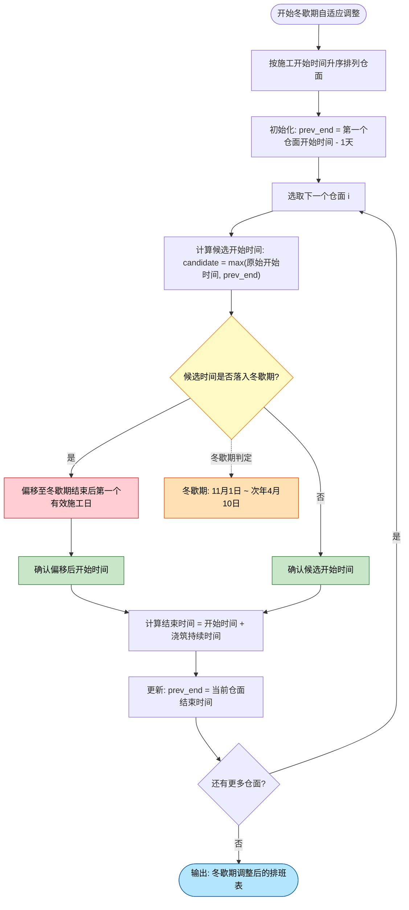
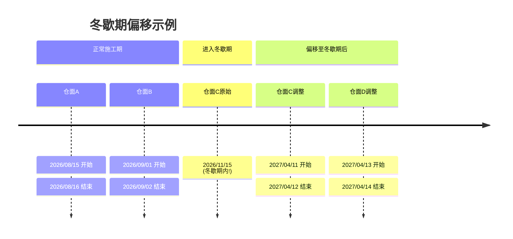
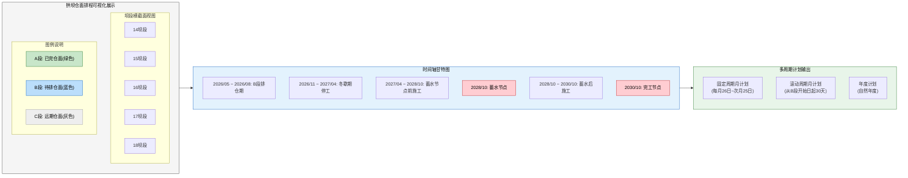
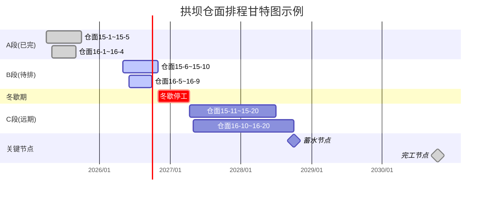

# 发明专利申请书

## 一种基于组合赋权与多约束协同优化的拱坝智能排仓方法

---

### 一、技术领域

本发明属于水利水电工程施工管理与智能建造技术领域，具体涉及一种基于组合赋权与多约束协同优化的拱坝混凝土浇筑仓面智能排序与动态排程方法，尤其适用于高拱坝施工过程中仓面浇筑顺序的智能决策与工期优化。

---

### 二、背景技术

拱坝混凝土浇筑施工是水利水电工程建设的核心环节，其仓面排序与排程决策直接影响工程质量、施工安全和工期目标。拱坝仓面排序问题具有以下显著特征：

**（1）多维约束耦合性**：拱坝仓面排序需同时满足相邻坝段高差约束、全局高差约束、层间间歇时间约束、缆机资源约束、冬歇期约束以及蓄水发电节点约束等多类约束条件，且各约束之间相互耦合、动态影响，构成复杂的组合优化问题。

**（2）动态演化性**：施工过程中实际浇筑进度与基准计划存在偏差，已完仓面、待排仓面与远期仓面的状态持续演化，要求排仓算法能够自适应地处理进度偏差并动态调整后续仓面排序。

**（3）多目标冲突性**：施工进度、资源均衡、结构安全等目标之间存在内在冲突，需要科学的多指标评价体系进行综合决策。

现有技术主要存在以下不足：

1. **主观赋权单一化**：传统方法多依赖专家经验进行仓面优先级判断，缺乏客观数据驱动的权重确定机制，导致排序结果受主观因素影响较大，难以保证科学性和可重复性。

2. **约束处理碎片化**：现有排仓方法通常将高差约束、间歇时间约束、资源约束等分别处理，缺乏统一的约束协同优化框架，容易产生约束冲突或次优解，难以保证全局可行性。

3. **静态排程局限性**：传统排仓方法基于静态基准计划进行一次性排程，无法根据实际施工进度动态调整，对施工偏差的适应性差，导致计划与实际脱节。

4. **工期优化粗放**：面对蓄水发电等关键节点约束，现有方法缺乏精细化的工期压缩策略，难以在保证施工质量的前提下有效缩短工期。

5. **冬歇期处理简单**：高寒地区拱坝施工存在冬歇期停工约束，现有方法对冬歇期的处理多为简单剔除，未考虑冬歇期前后仓面的合理衔接，容易造成工期浪费。

---

### 三、发明内容

#### 3.1 发明目的

本发明的目的在于克服现有技术的不足，提出一种基于组合赋权与多约束协同优化的拱坝智能排仓方法，通过构建AHP-熵权组合赋权模型、ABC动态分段机制、高差约束贪心微调算法、缆机资源约束排班算法、冬歇期自适应调整机制及关键路径工期压缩策略，实现拱坝仓面排序的多约束协同优化与动态智能决策。

#### 3.2 技术方案

本发明提供的一种基于组合赋权与多约束协同优化的拱坝智能排仓方法，包括以下步骤：

**步骤S1：多源数据融合与ABC动态分段**

采集基准计划数据、实际完成数据、仓面指标数据和AHP专家评分数据，构建多源异构数据融合体系；基于实际完成进度与基准计划的比对分析，将全部仓面动态划分为A段（已完仓面）、B段（待排仓面）和C段（远期仓面）三个区段；

其中，A段划分采用双层判定机制：第一层基于仓面编号匹配，将基准计划中与实际完成记录匹配的仓面划入A段；第二层基于高程覆盖判定，对于基准计划中仓顶高程低于对应坝段实际最大浇筑高程的仓面，即使未在完成记录中直接匹配，也划入A段，并自动补全其实际施工时间记录；

B段划分采用时间窗口与扩展选取相结合的策略：首先将基准计划结束时间早于截止时间的非A段仓面划入B1子段，然后从截止时间之后的仓面中按计划结束时间升序选取前N个仓面划入B2子段，B1与B2合并构成B段；

C段为剩余未划入A段和B段的仓面，采用基准计划顺延策略安排施工时间。

**步骤S2：AHP-熵权组合赋权模型构建**

针对B段仓面的多维评价指标体系，构建主观赋权与客观赋权相融合的组合赋权模型；

其中，主观赋权采用多专家AHP群体决策方法：采集多位专家的判断矩阵，采用几何平均法构建群体复合判断矩阵，通过列归一化与行均值计算得到AHP权重向量，并计算一致性比率CR进行一致性检验；

客观赋权采用信息熵权法：对B段仓面指标数据矩阵进行概率分布计算，基于信息熵度量各指标的信息效用值，将信息效用值归一化得到熵权向量；

组合赋权采用线性加权融合公式：

$$W_c = \alpha \cdot W_{AHP} + (1 - \alpha) \cdot W_{entropy}$$

其中，α为主观偏好系数，取值范围为[0,1]，用于调节主观权重与客观权重的相对影响程度。

**步骤S3：多指标归一化与综合评分排序**

对B段仓面的多维指标数据进行归一化处理，构建标准化评分矩阵；

其中，归一化处理采用自适应极差归一化方法：首先识别二值型指标与连续型指标，对于二值型指标保持原值不变，对于连续型指标根据效益型/成本型属性分别采用正向归一化或逆向归一化；

基于组合权重向量与标准化评分矩阵的加权求和，计算各仓面的综合评分，按综合评分降序排列得到初始排序结果。

**步骤S4：层号约束纠正**

对初始排序结果进行层号约束纠正，确保同一坝段内仓面按层号升序排列；

其中，层号约束纠正采用局部重排策略：遍历排序结果中同一坝段的仓面集合，按层号升序重新排列其在排序序列中的相对位置，同时保持不同坝段之间的相对顺序不变。

**步骤S5：高差约束贪心微调排序**

在层号纠正后的排序基础上，基于相邻坝段高差约束和全局高差约束进行贪心微调，生成满足高差约束的最终排序方案；

其中，高差约束贪心微调算法的具体步骤为：

（S5-1）根据仓面指标数据计算各仓面的坝顶高程，建立坝段-高程映射关系；

（S5-2）初始化各坝段当前高程状态，对于A段已完仓面，将其实际浇筑高程作为初始状态；

（S5-3）按排序顺序依次尝试放置仓面：对于每个待放置仓面，计算假设放置后各坝段的临时高程状态，检验是否满足相邻坝段高差约束（相邻坝段高差不超过相邻高差限值）和全局高差约束（所有坝段最大高差不超过全局高差限值）；

（S5-4）若满足约束则确认放置并更新高程状态，若不满足则跳过该仓面继续尝试下一个；

（S5-5）当所有仓面均尝试过一次后，将未放置的仓面按原始顺序追加至末尾。

**步骤S6：缆机资源约束排班**

基于最终排序方案，结合缆机资源约束和层间间歇时间约束进行施工排班；

其中，缆机资源约束排班算法的具体步骤为：

（S6-1）建立每日缆机使用量跟踪表和各坝段最后浇筑日记录表；

（S6-2）对于每个仓面，根据其所属坝段的最后浇筑日和参考间歇时间，计算目标浇筑日和允许浇筑窗口[低限日, 高限日]；

（S6-3）在允许浇筑窗口内，搜索缆机资源可用且最接近目标浇筑日的日期作为实际浇筑日；

（S6-4）若窗口内无可用日期，则在窗口外向后搜索最早的可用日期；

（S6-5）更新缆机使用量表和坝段最后浇筑日记录。

**步骤S7：冬歇期自适应调整**

对排班结果进行冬歇期约束处理，确保所有仓面施工时间避开冬歇期；

其中，冬歇期自适应调整采用迭代偏移策略：按施工时间顺序遍历仓面，对于落入冬歇期内的仓面，将其开始时间偏移至冬歇期结束后的第一个有效施工日，并级联调整后续仓面的施工时间，确保仓面间的时间先后关系不被破坏。

**步骤S8：ABC段完整排程整合与C段冬歇期感知重排**

将A段实际时间、B段排班时间和C段计划时间进行整合，生成完整排程表；

其中，C段排程采用冬歇期感知的批量偏移策略：计算B段排班导致的工期偏移量，将C段的基准开始时间偏移相应量并跳过冬歇期，按批次保持C段仓面间的相对时间间隔，确保C段仓面在冬歇期约束下的合理排布。

**步骤S9：关键路径工期压缩优化（可选）**

当存在蓄水发电节点约束或完工日期约束时，启动工期压缩优化策略；

其中，工期压缩优化包括间歇时间压缩和关键路径优先两个维度：

间歇时间压缩：遍历各坝段的层间间歇时间，对处于可压缩范围内的间歇时间按步长逐步缩减，同时保证不低于最小间歇时间要求，压缩后级联调整后续仓面时间；

关键路径优先：根据蓄水高程和完工日期约束，识别关键路径仓面集合，将关键路径仓面的开始时间尽可能提前，优先满足蓄水节点约束，再满足完工节点约束，最终校验约束满足情况。

#### 3.3 有益效果

本发明相比现有技术具有以下显著优点：

1. **主客观融合的科学赋权**：通过AHP-熵权组合赋权模型，将专家经验判断与数据驱动的客观权重有机融合，既保留了领域专家对施工规律的深刻认知，又充分利用了实际施工数据的统计信息，有效克服了单一赋权方法的局限性，提高了仓面优先级评价的科学性和鲁棒性。

2. **多约束协同优化**：创新性地提出"评分排序→层号纠正→高差贪心微调→缆机排班→冬歇期调整"的五阶段约束协同优化框架，将多维约束条件分层递进地融入排序决策过程，既保证了各约束条件的满足，又避免了约束冲突，实现了全局可行性。

3. **动态自适应分段机制**：基于实际施工进度的ABC动态分段机制，能够自适应地处理施工偏差，将已完仓面、待排仓面和远期仓面区别对待，实现了排仓决策与施工进度的动态耦合，显著提高了排仓方案的实用性。

4. **精细化工期压缩**：通过间歇时间压缩与关键路径优先的双重优化策略，在保证施工质量和安全的前提下，有效缩短关键路径工期，提高蓄水发电节点约束的满足率。

5. **冬歇期智能处理**：冬歇期自适应调整与C段冬歇期感知重排机制，确保高寒地区拱坝施工排程的合理性，避免冬歇期前后的工期浪费，提高施工连续性。

6. **多周期计划输出**：支持固定周期月计划、滚动周期月计划和年计划等多种计划窗口的自动生成与一致性校验，满足不同层级施工管理的需求。

---

### 四、附图说明

**图1** 为本发明方法的总体流程图；

**图2** 为ABC动态分段机制示意图；

**图3** 为AHP-熵权组合赋权模型计算流程图；

**图4** 为高差约束贪心微调算法流程图；

**图5** 为缆机资源约束排班算法流程图；

**图6** 为冬歇期自适应调整示意图；

**图7** 为关键路径工期压缩优化流程图；

**图8** 为拱坝仓面排程可视化展示示意图。

---

#### 图1 本发明方法的总体流程图

---

#### 图2 ABC动态分段机制示意图

---

#### 图3 AHP-熵权组合赋权模型计算流程图

---

#### 图4 高差约束贪心微调算法流程图

---

#### 图5 缆机资源约束排班算法流程图

---

#### 图6 冬歇期自适应调整示意图

---

#### 图7 关键路径工期压缩优化流程图

```mermaid
flowchart TD
    START([开始工期压缩优化]) --> INPUT["输入: 排班结果, 蓄水日期, 蓄水高程, 完工日期"]

    INPUT --> COMPRESS{启用间歇时间压缩?}
    COMPRESS -->|是| BUILD_DAM_MAP[构建坝段-仓面映射表]
    BUILD_DAM_MAP --> ITER_DAM[遍历各坝段]
    ITER_DAM --> ITER_LAYER[遍历相邻层对]
    ITER_LAYER --> GAP_CHECK{间歇时间在可压缩范围内?}
    GAP_CHECK -->|是| REDUCE["缩减间歇: new_gap = max(min_gap, gap - step)"]
    REDUCE --> ADJUST_TIME["调整当前仓面: 开始时间 = 上一层结束时间 + new_gap"]
    ADJUST_TIME --> NEXT_PAIR[下一层对]
    GAP_CHECK -->|否| NEXT_PAIR
    NEXT_PAIR --> MORE_LAYER{还有更多层对?}
    MORE_LAYER -->|是| ITER_LAYER
    MORE_LAYER -->|否| MORE_DAM{还有更多坝段?}
    MORE_DAM -->|是| ITER_DAM
    MORE_DAM -->|否| RECASCADE1[级联调整后续仓面时间]

    COMPRESS -->|否| CRITICAL
    RECASCADE1 --> CRITICAL

    CRITICAL{启用关键路径优先?}
    CRITICAL -->|是| IDENTIFY_WATER["识别蓄水关键仓面: TopElev <= 蓄水高程"]
    IDENTIFY_WATER --> IDENTIFY_COMP["识别完工关键仓面: TopElev > 蓄水高程"]

    IDENTIFY_WATER --> ADVANCE_WATER[将蓄水关键仓面开始时间尽可能提前]
    ADVANCE_WATER --> RECASCADE2[级联调整后续仓面时间]

    RECASCADE2 --> ADVANCE_COMP[将完工关键仓面开始时间尽可能提前]
    ADVANCE_COMP --> RECASCADE3[级联调整后续仓面时间]

    IDENTIFY_COMP --> ADVANCE_WATER
    CRITICAL -->|否| VERIFY

    RECASCADE3 --> VERIFY[约束校验]
    VERIFY --> WATER_OK{蓄水约束满足?}
    WATER_OK -->|是| COMP_OK{完工约束满足?}
    WATER_OK -->|否| RESULT1["结果: 蓄水约束未满足"]
    COMP_OK -->|是| RESULT2["结果: 全部约束满足"]
    COMP_OK -->|否| RESULT3["结果: 完工约束未满足"]

    RESULT1 --> OUTPUT([输出: 压缩结果与约束校验报告])
    RESULT2 --> OUTPUT
    RESULT3 --> OUTPUT

    style GAP_CHECK fill:#FFF9C4,stroke:#F57F17,color:#000
    style CRITICAL fill:#FFF9C4,stroke:#F57F17,color:#000
    style COMPRESS fill:#FFF9C4,stroke:#F57F17,color:#000
    style WATER_OK fill:#FFF9C4,stroke:#F57F17,color:#000
    style COMP_OK fill:#FFF9C4,stroke:#F57F17,color:#000
    style RESULT2 fill:#C8E6C9,stroke:#2E7D32,color:#000
    style RESULT1 fill:#FFCDD2,stroke:#C62828,color:#000
    style RESULT3 fill:#FFE0B2,stroke:#E65100,color:#000
    style OUTPUT fill:#B3E5FC,stroke:#01579B,color:#000
```

---

#### 图8 拱坝仓面排程可视化展示示意图

---

### 五、具体实施方式

下面结合附图和具体实施例对本发明作进一步详细说明。

**实施例1：某高拱坝智能排仓应用**

以某双曲拱坝工程为例，该坝共22个坝段，每个坝段最多60个浇筑层，总仓面数约1200个。施工区域冬季（11月1日至次年4月10日）停工，配置4台缆机，蓄水日期为2028年10月1日，蓄水高程920m，完工日期2030年10月15日。

**步骤S1：多源数据融合与ABC动态分段**

从工程数据库同步基准计划数据（包含DamID、LayerID、TopElev、PlanStart、PlanEnd等字段）和实际完成数据（包含DamID、LayerID、ActualStart、ActualEnd、ActualTopElev等字段）。基准计划共1200个仓面，实际已完成约300个仓面。

A段划分：第一层通过仓面编号匹配，将基准计划中与实际完成记录匹配的仓面划入A段；第二层通过高程覆盖判定，对于基准计划中仓顶高程低于对应坝段实际最大浇筑高程的仓面，也划入A段。最终A段仓面约320个。

B段划分：截止时间取实际完成记录中最晚的计划结束时间。B1子段为截止时间之前未划入A段的仓面，约180个；B2子段从截止时间之后按计划结束时间升序选取前10个仓面。B段合计约190个仓面。

C段为剩余约690个仓面。

**步骤S2：AHP-熵权组合赋权模型构建**

B段仓面的评价指标体系包含6个指标：坝段高程（到坝顶距离）、奇偶坝段标识、孔口坝段标识、浇筑方量、顶块间歇时间、浇筑强度。其中顶块间歇时间为成本型指标，其余为效益型指标。

AHP赋权：3位专家分别给出6×6判断矩阵，采用几何平均法构建群体复合判断矩阵，计算得到AHP权重向量为W_AHP = [0.25, 0.20, 0.18, 0.15, 0.12, 0.10]，一致性比率CR = 0.05 < 0.10，通过一致性检验。

熵权赋权：对B段190个仓面的6维指标数据矩阵计算信息熵，得到熵权向量为W_entropy。

组合赋权：取α = 0.5，计算组合权重W_c = 0.5 × W_AHP + 0.5 × W_entropy，归一化后得到最终权重向量。

**步骤S3：多指标归一化与综合评分排序**

对6维指标数据进行自适应极差归一化：奇偶坝段标识和孔口坝段标识为二值型指标，保持原值；坝段高程、浇筑方量、浇筑强度为效益型连续指标，采用正向极差归一化；顶块间歇时间为成本型连续指标，采用逆向极差归一化。

计算综合评分S = X_n × W_c，按评分降序排列得到初始排序。

**步骤S4：层号约束纠正**

遍历初始排序中同一坝段的仓面，按层号升序重新排列。例如，若坝段15的仓面在初始排序中出现的顺序为15-5、15-3、15-7，纠正后调整为15-3、15-5、15-7。

**步骤S5：高差约束贪心微调排序**

设定基准高程常数为990m，相邻高差限值为6m，全局高差限值为12m。从A段已完仓面提取各坝段当前高程状态作为初始值。

按排序顺序依次尝试放置仓面：假设放置仓面15-8后，坝段15的高程变为970m，检查相邻坝段14和坝段16的当前高程，若坝段14当前高程为965m，则高差为5m < 6m，满足相邻高差约束；同时检查全局高差，若所有坝段最大高差为10m < 12m，满足全局高差约束，确认放置。

若放置仓面18-6后，坝段18高程变为975m，而相邻坝段17当前高程为968m，高差为7m > 6m，不满足相邻高差约束，跳过该仓面继续尝试下一个。

**步骤S6：缆机资源约束排班**

设定每日最大缆机使用量为4台，最小间歇时间为7天，最大间歇时间为20天。排班起始日期为2026年5月1日。

对于仓面15-8，坝段15的最后浇筑日为第10天，参考间歇时间为10天，目标浇筑日为第20天，允许窗口为[17, 30]。在窗口内搜索缆机可用且最接近第20天的日期，假设第20天已使用3台缆机，加上本仓面需1台共4台 ≤ 4台，则第20天可用，确认为浇筑日。

**步骤S7：冬歇期自适应调整**

冬歇期为11月1日至次年4月10日。按施工时间顺序遍历仓面，若某仓面的开始时间落入冬歇期，则偏移至4月11日，并级联调整后续仓面。

**步骤S8：ABC段完整排程整合**

A段仓面使用实际施工时间，B段仓面使用排班计算时间，C段仓面基于基准计划时间偏移B段导致的工期差并跳过冬歇期。生成完整排程表，包含仓面编号、坝段号、层号、仓顶高程、计划时间、最终时间等字段。

**步骤S9：关键路径工期压缩优化**

启动压缩模式：间歇时间压缩步长为1天，将14-20天范围内的间歇时间逐步缩减至最小7天；关键路径优先策略将蓄水高程920m以下的仓面优先提前，确保2028年10月1日前完成蓄水节点仓面，再将920m以上的仓面提前以满足2030年10月15日完工约束。最终校验蓄水约束和完工约束的满足情况。

**实施例2：正常模式排仓**

不启用工期压缩，采用正常模式排班。在允许浇筑窗口内选择最接近目标浇筑日的日期，保证间歇时间接近参考值，施工节奏平稳。若存在截止日期约束，校验最终完工日期是否满足，不满足时标记为"正常模式超期"并计算超期天数。

---

### 六、权利要求书

**1.** 一种基于组合赋权与多约束协同优化的拱坝智能排仓方法，其特征在于，包括以下步骤：

S1、多源数据融合与ABC动态分段：采集基准计划数据、实际完成数据、仓面指标数据和AHP专家评分数据，基于实际完成进度与基准计划的比对分析，将全部仓面动态划分为A段已完仓面、B段待排仓面和C段远期仓面；

S2、AHP-熵权组合赋权模型构建：针对B段仓面的多维评价指标体系，采用多专家AHP群体决策方法确定主观权重，采用信息熵权法确定客观权重，通过线性加权融合公式计算组合权重；

S3、多指标归一化与综合评分排序：对B段仓面的多维指标数据进行自适应极差归一化处理，基于组合权重与标准化评分矩阵的加权求和计算综合评分，按评分降序排列得到初始排序；

S4、层号约束纠正：对初始排序结果进行层号约束纠正，确保同一坝段内仓面按层号升序排列；

S5、高差约束贪心微调排序：在层号纠正后的排序基础上，基于相邻坝段高差约束和全局高差约束进行贪心微调，生成满足高差约束的最终排序方案；

S6、缆机资源约束排班：基于最终排序方案，结合缆机资源约束和层间间歇时间约束进行施工排班；

S7、冬歇期自适应调整：对排班结果进行冬歇期约束处理，采用迭代偏移策略确保所有仓面施工时间避开冬歇期；

S8、ABC段完整排程整合与C段冬歇期感知重排：将A段实际时间、B段排班时间和C段计划时间进行整合，C段采用冬歇期感知的批量偏移策略排布。

**2.** 根据权利要求1所述的拱坝智能排仓方法，其特征在于，步骤S1中A段划分采用双层判定机制：第一层基于仓面编号匹配，将基准计划中与实际完成记录匹配的仓面划入A段；第二层基于高程覆盖判定，对于基准计划中仓顶高程低于对应坝段实际最大浇筑高程的仓面也划入A段。

**3.** 根据权利要求1所述的拱坝智能排仓方法，其特征在于，步骤S1中B段划分采用时间窗口与扩展选取相结合的策略：将基准计划结束时间早于截止时间的非A段仓面划入B1子段，从截止时间之后的仓面中按计划结束时间升序选取前N个划入B2子段，B1与B2合并构成B段。

**4.** 根据权利要求1所述的拱坝智能排仓方法，其特征在于，步骤S2中多专家AHP群体决策方法采用几何平均法构建群体复合判断矩阵，通过列归一化与行均值计算AHP权重向量，并计算一致性比率CR进行一致性检验。

**5.** 根据权利要求1所述的拱坝智能排仓方法，其特征在于，步骤S3中自适应极差归一化方法首先识别二值型指标与连续型指标，对于二值型指标保持原值不变，对于连续型指标根据效益型/成本型属性分别采用正向极差归一化或逆向极差归一化。

**6.** 根据权利要求1所述的拱坝智能排仓方法，其特征在于，步骤S5中高差约束贪心微调算法的具体步骤为：根据仓面指标数据计算各仓面的坝顶高程，初始化各坝段当前高程状态为A段已完仓面的实际浇筑高程，按排序顺序依次尝试放置仓面，检验假设放置后是否满足相邻坝段高差约束和全局高差约束，满足则确认放置并更新高程状态，不满足则跳过继续尝试下一个，最终将未放置仓面追加至末尾。

**7.** 根据权利要求1所述的拱坝智能排仓方法，其特征在于，步骤S6中缆机资源约束排班算法的具体步骤为：建立每日缆机使用量跟踪表和各坝段最后浇筑日记录表，对于每个仓面根据所属坝段的最后浇筑日和参考间歇时间计算目标浇筑日和允许浇筑窗口，在允许浇筑窗口内搜索缆机资源可用且最接近目标浇筑日的日期作为实际浇筑日，若窗口内无可用日期则在窗口外向后搜索。

**8.** 根据权利要求1所述的拱坝智能排仓方法，其特征在于，步骤S7中冬歇期自适应调整采用迭代偏移策略：按施工时间顺序遍历仓面，对于落入冬歇期内的仓面将其开始时间偏移至冬歇期结束后的第一个有效施工日，并级联调整后续仓面的施工时间。

**9.** 根据权利要求1所述的拱坝智能排仓方法，其特征在于，步骤S8中C段冬歇期感知重排策略为：计算B段排班导致的工期偏移量，将C段的基准开始时间偏移相应量并跳过冬歇期，按批次保持C段仓面间的相对时间间隔。

**10.** 根据权利要求1至9任一项所述的拱坝智能排仓方法，其特征在于，还包括步骤S9关键路径工期压缩优化：当存在蓄水发电节点约束或完工日期约束时，通过间歇时间压缩和关键路径优先两个维度进行工期压缩优化；其中间歇时间压缩为遍历各坝段层间间歇时间，对可压缩范围内的间歇时间按步长逐步缩减；关键路径优先为根据蓄水高程和完工日期约束识别关键路径仓面集合，将关键路径仓面的开始时间尽可能提前。

---

### 七、说明书摘要

本发明公开了一种基于组合赋权与多约束协同优化的拱坝智能排仓方法，属于水利水电工程施工管理技术领域。该方法包括：多源数据融合与ABC动态分段；AHP-熵权组合赋权模型构建；多指标归一化与综合评分排序；层号约束纠正；高差约束贪心微调排序；缆机资源约束排班；冬歇期自适应调整；ABC段完整排程整合与C段冬歇期感知重排；关键路径工期压缩优化。本发明通过主客观融合赋权、五阶段约束协同优化框架和动态自适应分段机制，实现了拱坝仓面排序的多约束协同优化与动态智能决策，显著提高了排仓方案的科学性、可行性和实用性。

**摘要附图：** 图1

---

### 八、关键词

拱坝；智能排仓；组合赋权；多约束优化；动态分段；高差约束；缆机排班；冬歇期调整；工期压缩
