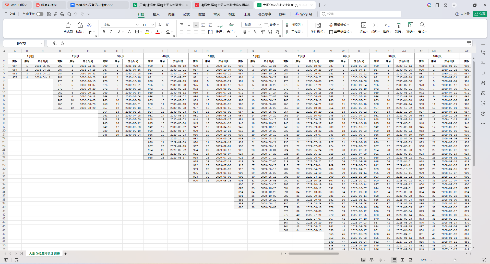

# 拱坝智能排仓系统

## 软件概述

拱坝智能排仓系统 V2.0 是一款面向水利水电工程拱坝混凝土浇筑施工管理的专业化软件，由中国葛洲坝集团第二工程有限公司开发。

本软件针对拱坝施工中仓面（混凝土浇筑单元）排序依赖人工经验、多约束条件难以同时兼顾的实际问题，采用层次分析法（AHP）与熵权法组合赋权的多目标决策方法，结合浇筑高差约束、缆机资源约束和冬歇期避让规则，自动计算生成最优的仓面浇筑顺序和缆机排班方案。

软件以 Web 服务形式部署，前端采用 Vue3 + TypeScript 构建交互界面，后端基于 Python FastAPI 提供高性能异步计算服务，通过 WebSocket 实时推送排仓计算进度。排仓结果以 ECharts 散点图可视化展示，并自动生成多维度施工计划 Excel 报表，可直接用于现场施工管理。

主要功能包括：数据库连接与数据同步、ABC 三段智能划分、AHP-熵权法组合赋权、高差约束三级漏斗排序、缆机资源排班调度、冬歇期自动避开、工期压缩优化、施工计划多窗口可视化、多格式 Excel 报表生成和实时 WebSocket 日志推送。

## 适用对象

本软件适用于以下用户群体：

- **施工项目经理**：查看排仓方案的整体进度和工期满足情况，辅助施工调度决策。
- **施工技术负责人**：审核排仓计算参数（AHP 判断矩阵、权重系数等），确认技术方案的合理性。
- **混凝土浇筑调度员**：根据排仓输出的日浇筑计划，安排现场缆机和人员调度。
- **工程决策者**：对是否启用工期压缩、设置截止日期等关键决策进行把关。

使用者应具备基本的计算机操作能力和拱坝施工管理基础知识。

## 运行环境

**硬件环境要求：**

| 类型 | 最低配置 | 推荐配置 |
|------|----------|----------|
| CPU | Intel Core i5 处理器 | Intel Xeon / Core i7 处理器 |
| 内存 | 8 GB RAM | 32 GB RAM 及以上 |
| 硬盘 | 50 GB 可用空间 | 500 GB SSD |
| 网络 | 100Mbps | 1000Mbps |

**软件环境要求：**

- 操作系统：Windows 10/11 或 Windows Server 2019及以上版本
- Python 运行环境：Python 3.9 及以上版本
- 数据库：MySQL 5.7 及以上版本
- 前端服务：Node.js 16 及以上版本
- 浏览器：推荐使用 Chrome 或 Edge 最新版本

## 进入软件

本软件采用前后端分离的 Web 服务架构，启动方式如下：

1. **启动后端服务**：在项目根目录下执行 `python main.py` 或 `uvicorn main:app --host 0.0.0.0 --port 8000`，等待控制台提示服务启动成功。
2. **启动前端服务**：进入前端项目目录，执行 `npm run dev`，等待开发服务器启动。
3. **访问系统**：打开浏览器，输入前端服务对应的地址（默认 `http://localhost:5173`），进入系统操作界面。

系统启动后，用户首先看到的是主操作页面，左侧为功能导航区，右侧为内容操作区。

## 主要功能与操作

### 1. 数据库连接配置与数据同步

该功能用于配置和测试与 MySQL 数据库的连接，并从数据库中同步施工所需的基准数据。

用户在左侧导航栏点击数据库配置后，进入数据库连接配置面板。面板中需要填写以下连接参数：数据库主机地址（Host）、端口号（Port）、用户名（Username）、密码（Password）和数据库名称（Database Name）。

填写完成后，点击"测试连接"按钮。系统会尝试连接指定的 MySQL 数据库，连接成功后显示"连接成功"提示，连接失败则会显示具体的错误信息（如主机不可达、用户名或密码错误等）。

连接成功后，用户可通过数据同步功能从数据库导入以下基础数据表：
- **BaselineSchedule**（基准施工计划）：定义各仓面的原计划浇筑日期和工期。
- **ActualDone**（实际完成记录）：记录已浇筑完成仓面的实际完成日期。

同步完成后，数据会保存到本地，供后续排仓计算使用。

### 2. 文件上传与数据准备

该功能用于上传排仓计算所需的 Excel 数据文件。

用户进入文件管理模块后，可以看到文件上传区域。排仓计算需要以下四个核心数据文件：

1. **BaselineSchedule.xlsx**：基准施工计划表，包含各坝段仓面的原计划信息。
2. **ActualDone.xlsx**：实际完成记录表，记录已浇筑仓面的完成情况。
3. **WarehouseData_filled.xlsx**：仓面指标数据表，包含各仓面的施工参数（工期、方量、高程等）。
4. **AHPScores.xlsx**：AHP 专家判断矩阵表，多位专家对各评价指标的两两比较评分。

用户可逐个点击上传按钮选择对应的 Excel 文件，也可一次性拖拽多个文件到上传区域。上传完成后，文件列表会显示文件名、上传时间和文件大小。用户也可以随时删除已上传的文件并重新上传。

如果已通过数据库同步功能获取了数据，部分文件可跳过上传，系统会自动使用数据库中的最新数据。

### 3. 运行参数设置

该功能用于设置排仓计算的各项运行参数。

用户进入排仓参数面板后，可以设置以下核心参数：

- **排仓开始日期**：指定排仓计算的起点日期。系统会从该日期开始安排未浇筑仓面的施工顺序。
- **截止日期（可选）**：如需在特定期限内完成所有仓面浇筑，可设置截止日期。设置后系统会判断当前方案能否满足工期要求。
- **启用工期压缩**：当设置截止日期后，可选择是否启用工期压缩模式。启用后，系统会尝试通过缩短同坝段间歇时间和优化缆机资源调配来满足工期要求。
- **AHP 权重系数 α**：控制主观权重（AHP）与客观权重（熵权法）的混合比例。默认值为 0.5，即两者各占一半。α 越大，主观权重的影响越大。

启用工期压缩时，还可进一步设置蓄水发电日期和完工日期，以便系统判断压缩的紧迫程度。

### 4. 执行排仓计算

该功能是软件的核心操作，一键启动全自动排仓计算流程。

用户在确认数据准备就绪和参数设置无误后，点击"生成排仓"按钮，系统随即启动完整的排仓计算管线。计算过程包含以下十个步骤：

1. 数据准备：读取并校验所有输入数据。
2. ABC 段划分：按实际完成进度划分已完成段（A）、当前排仓段（B）和未来待排段（C）。
3. 主观权重计算：读取专家判断矩阵，通过几何平均法合成专家组意见，计算 AHP 主观权重并进行一致性检验（要求 CR < 0.1）。
4. 客观权重计算：基于 B 段仓面指标数据的离散程度，利用熵权法计算客观权重。
5. 组合赋权：使用 α 系数将主观权重与客观权重合并为组合权重。
6. 综合得分排序：为每个 B 段仓面计算综合得分，按得分由高到低初步排序。
7. 高差约束微调：采用三级漏斗筛选机制（L1 严格/L2 放宽/L3 兜底），调整顺序以确保相邻坝段高差满足施工安全要求。
8. 缆机排班：按日最大缆机容量（默认 4 台）和同坝段间歇约束（7-20 天），为仓面序列分配施工日期。
9. 冬歇期处理：自动识别并避开 11 月 1 日至次年 4 月 10 日的冬歇期，整体后移落入冬歇期的施工计划。
10. （可选）工期压缩：若启用压缩模式，在保证安全的前提下缩短间歇时间以满足截止日期。

计算过程中，右侧日志区会通过 WebSocket 实时推送每个步骤的名称、状态（进行中/已完成）和详细信息，用户可随时了解当前计算进度。

### 5. 查看排仓结果

排仓计算完成后，系统自动展示结果。用户可以在结果摘要区和可视化图表区查看排仓成果。

**结果摘要区**显示以下关键信息：
- 固定周期窗口（上月 26 日至本月 25 日）内排仓仓面数量。
- 滚动周期窗口内排仓仓面数量。
- 当前方案模式：正常模式或压缩模式。
- 工期满足状态：提前完成、按期完成或超期。

**可视化图表区**提供以下 ECharts 散点图：
- 固定周期坝段-层号浇筑顺序散点图：以坝段编号为横轴、层号为纵轴，按浇筑顺序编号标注，展示固定窗口内的施工布局。
- 滚动周期坝段-层号浇筑顺序散点图：同样的图表形式，但展示 B 段起始日至下月同日前一天的施工安排。

同时，系统还会进行排仓结果的一致性检查，如发现冬季施工、高差异常等问题会在界面中提示。

### 6. 导出施工报表

排仓结果生成后，系统自动在后台输出目录中生成多份 Excel 报表文件。用户可在文件管理区查看并下载这些报表。

系统自动生成的报表包括：

1. **完整排仓计划表**：包含全部仓面（A+B+C 段）的 7 列标准信息（坝段、层号、浇筑日期、方量、高程等），是最完整的一览表。
2. **固定周期月计划表**：按上月 26 日至本月 25 日窗口筛选的当月施工计划。
3. **滚动周期月计划表**：按滚动窗口筛选的施工计划。
4. **年计划表**：按年度汇总的施工计划。
5. **总排仓计划交叉表**：以坝段为行、层号为列的交叉格式，直观展示大坝整体施工进度。

用户点击文件名即可下载对应的 Excel 文件。此外，还可以点击"打开输出目录"按钮，在系统文件管理器中直接查看所有输出文件，包括自动生成的 PNG 散点图。

### 7. 数据库同步与历史查询

该功能用于将排仓计算结果保存到 MySQL 数据库（AIWARE 数据库），并支持查询历史运行记录。

排仓完成后，系统会自动触发同步服务，将以下数据写入数据库：
- 排仓运行记录：包括运行时间、参数设置、结果统计等元信息。
- 仓面计划详情：每个仓面的浇筑日期、方量、高程等具体计划数据。
- 月计划窗口：固定周期和滚动周期的施工计划数据。
- 权重配置：本次排仓使用的 AHP 权重、熵权权重和组合权重。

用户可以在历史记录页面查看过往的排仓运行记录，按时间筛选，并点击进入查看某次运行的完整排仓结果。这为施工管理人员追溯历史排仓方案、对比不同参数设置下的效果提供了便利。

## 典型使用流程

以下是一个完整的端到端使用案例，以某拱坝工程的月度排仓任务为例，帮助审核人员理解各功能模块之间的衔接关系。

**场景**：某拱坝工程已浇筑完成 60% 的仓面，现需对剩余 40% 的仓面进行本月度排仓。施工经理需要在 2026 年 12 月 31 日前完成全部浇筑。

**第一步：配置数据库连接。** 施工技术人员打开软件，在数据库配置面板填写项目部 MySQL 数据库的连接参数（主机地址、端口、用户名和密码），点击"测试连接"按钮确认连接正常。

**第二步：同步基础数据。** 通过数据同步功能，从数据库中拉取最新的 BaselineSchedule 和 ActualDone 数据。系统自动将数据保存到本地处理目录。

**第三步：上传补充数据文件。** 进入文件管理模块，将专家最新填写的 AHPScores.xlsx 和更新后的 WarehouseData_filled.xlsx 上传到系统中。

**第四步：设置运行参数。** 在参数面板中，将排仓开始日期设为当月第一天，截止日期设为 2026 年 12 月 31 日，勾选"启用工期压缩"，AHP 权重系数保持默认值 0.5。

**第五步：执行排仓计算。** 点击"生成排仓"按钮，系统开始自动计算。施工经理通过右侧日志面板实时观察十个计算步骤的进度，每个步骤完成后自动进入下一步。

**第六步：查看排仓结果。** 计算完成后，施工经理在结果摘要区看到滚动周期内共有 45 个仓面、当前为压缩模式、工期标记为"按期完成"。在散点图中确认坝段分布均匀，安全高差满足要求。一致性检查无异常。

**第七步：导出施工报表。** 进入文件管理区，下载"完整排仓计划表"和"滚动周期月计划表"，分发给现场各组作为本月施工依据。同时将排仓运行记录同步保存至数据库，便于后续追溯。

至此，一次完整的月度排仓任务执行完毕。

## 注意事项

1. **数据库连接**：在使用数据库同步功能前，请确保 MySQL 服务已启动，且网络防火墙允许对数据库端口的访问。
2. **数据文件格式**：上传的 Excel 文件必须严格按照模板格式填写，列名和字段顺序不能随意调整，否则可能导致数据读取失败。
3. **AHP 判断矩阵**：专家判断矩阵的一致性比率（CR）必须小于 0.1，否则系统会提示一致性检验未通过，需要专家重新评估后再次上传。
4. **冬歇期范围**：冬歇期默认为每年 11 月 1 日至次年 4 月 10 日。如工程所在地的冬歇期不同，请在配置文件中修改相应参数。
5. **工期压缩风险**：启用工期压缩模式会缩短同坝段仓面间歇时间，可能影响混凝土养护质量。建议仅在工期确实紧张且经过技术评估后启用。
6. **浏览器兼容性**：推荐使用 Chrome 或 Edge 最新版本访问系统。如使用其他浏览器出现界面显示异常，请更换推荐浏览器。
7. **数据备份**：每次排仓运行后，建议及时下载并备份生成的 Excel 报表文件，避免因输出目录清理导致数据丢失。